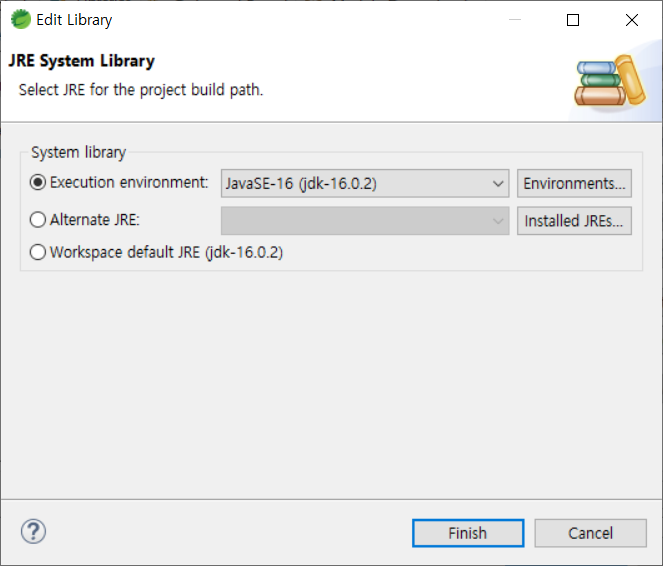
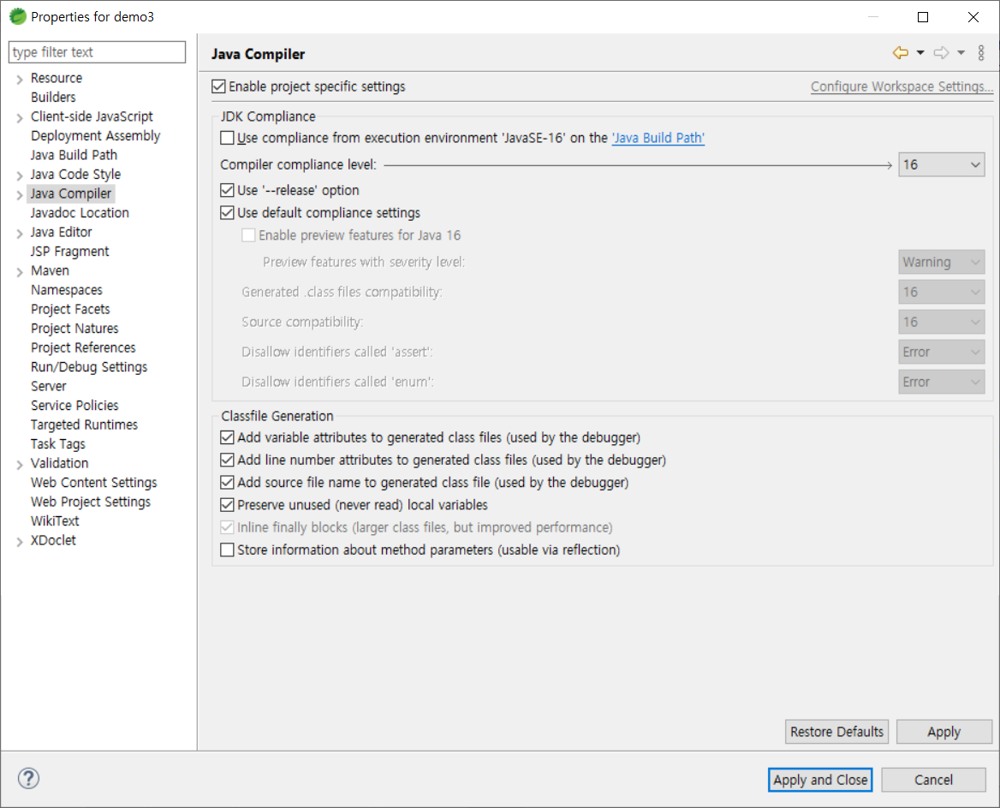
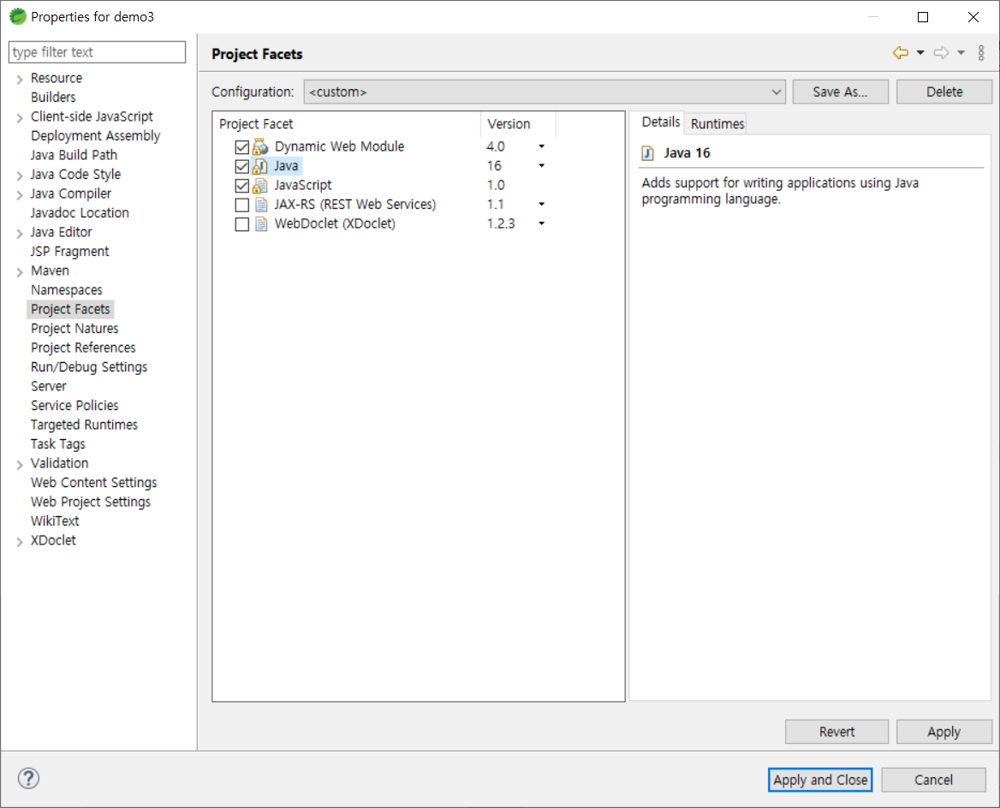
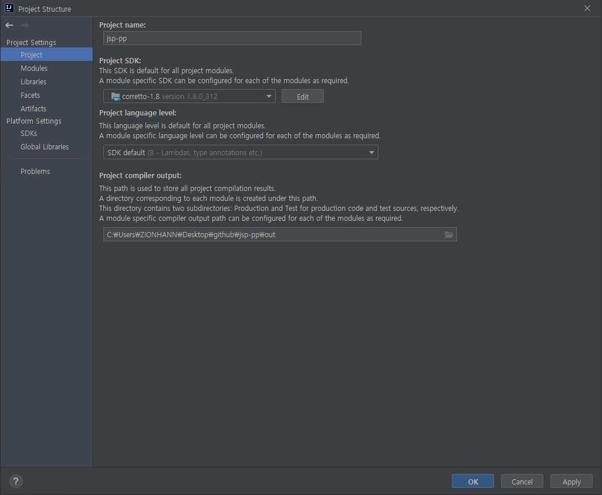
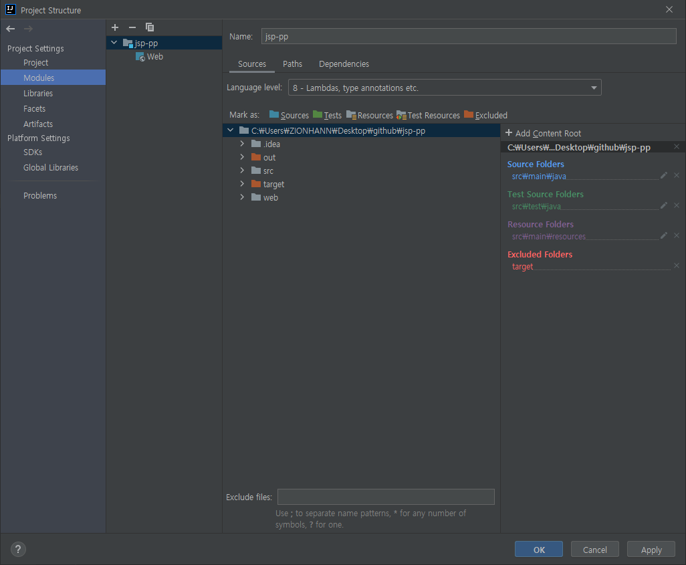
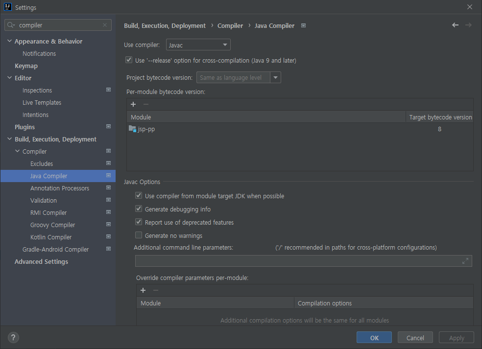

# 자바 버전 설정하기

Heroku에 자바 프로젝트를 배포하기 위해 Java 버전을 일치시키는 방법 2가지
1. 배포하는 프로젝트의 Java 버전을 Heroku에서 default로 설정된 Java 8(으)로 설정한다.
2. `system.properties` 파일을 통해 Heroku의 JDK 버전을 설정한다.

# 1. 프로젝트의 JDK 버전 설정

## STS4

### Java Build Path(Build Path > Configure Build Path > Libraries > Modulepath > Edit)


### Java Compiler


### Project Facets



## IntelliJ

### Project SDK


### Language level


### Java Compiler


## 2. `system.properties` 파일 설정

프로젝트의 `root` 폴더에 `system.properties` 파일을 생성하고 다음과 같은 코드를 입력한다.
```
java.runtime.version=[version]
```

heroku에서 지원하는 자바 버전은 다음과 같다.
- Java 7 - 1.7.0_322
- Java 8 - 1.8.0_312 (default)
- Java 11 - 11.0.13
- Java 13 - 13.0.9
- Java 15 - 15.0.5
- Java 17 - 17.0.1

[Heroku Java Support](https://devcenter.heroku.com/articles/java-support#supported-java-versions)